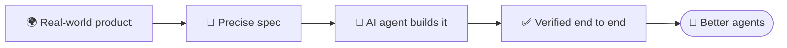

  
  
  

---

## 👋 Who I am

I'm **Mohd Rafey**, a full-stack software engineer at **[Ethara AI](https://ethara.ai)**.

I started out shipping products end to end: React front ends, Node and FastAPI back ends, Postgres, Docker, the deploy. Now I use that experience on a harder question:

> **When an AI agent says it built an app, did it actually build it?**

Most of my week goes into building the environments where AI coding agents are trained and tested, and the graders that decide whether their work is real.

 

## 🧪 What I do at Ethara AI

<table>
<tr>
<td width="50%" valign="top">

### 🏗️ Build RL environments
I design realistic, full-stack software tasks where AI coding agents have to build working web applications from a written spec, just like a real engineer would.

</td>
<td width="50%" valign="top">

### 🎯 Design automated grading
I write the checks that decide whether an agent's work actually runs end to end for a real user, not just whether it looks right.

</td>
</tr>
<tr>
<td width="50%" valign="top">

### 📐 Write product specifications
I turn real-world products into precise, buildable specs that are clear enough for a model to implement without guessing.

</td>
<td width="50%" valign="top">

### ⚔️ Harden task quality
I review and stress-test tasks so they stay challenging, stay fair, and can't be passed with shortcuts.

</td>
</tr>
</table>

 

## 🚀 My mission

### *Make an AI agent's score mean something.*

Benchmarks are easy to pass and hard to trust. An agent can hardcode an endpoint, render a stored number instead of computing it, or pattern-match a spec and still score. I want every point to stand for something a person could actually use: the page loads, the button works, the order lands in the database, the email goes out.

- ✅ **Grade behaviour, not implementation.** Any approach that works should score, and anything that doesn't should fail.
- 📏 **Measure difficulty, don't claim it.** A task is hard only after strong models have tried it and failed.
- 🐛 **A gamed task is my bug.** If a model finds a shortcut, the environment was wrong, and I fix the environment.

 

## 🛠️ Tech stack

<table>
<tr>
<td align="right" width="150"><b>🤖 AI & evals</b></td>
<td>
  
  
  
  
  
  
</td>
</tr>
<tr>
<td align="right"><b>💻 Languages</b></td>
<td></td>
</tr>
<tr>
<td align="right"><b>🎨 Frontend</b></td>
<td></td>
</tr>
<tr>
<td align="right"><b>⚙️ Backend & data</b></td>
<td></td>
</tr>
<tr>
<td align="right"><b>☁️ Cloud & infra</b></td>
<td></td>
</tr>
<tr>
<td align="right"><b>📱 Mobile</b></td>
<td>
  
  
  
</td>
</tr>
</table>

 

  

## 📫 Connect with me

  
  
  
  

  
💬 Working on agents, evals or RL environments? I'm always happy to talk shop.

  
🏢 Proudly building with <a href="https://ethara.ai">Ethara AI</a>

